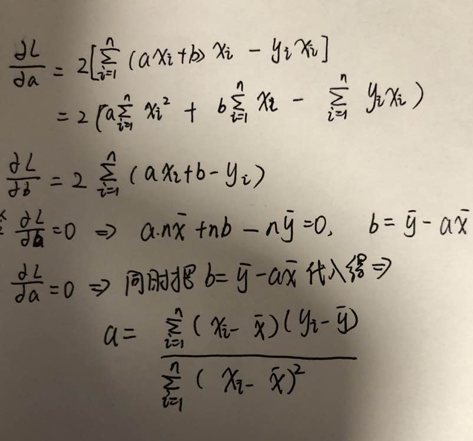

## 线性回归

简单线性回归方程 $$y=ax+b$$

损失函数为：平方损失函数   $$L=\sum_{i=0}^n(y-(ax_i+ b))^2$$

当损失函数最小，即L=0时，求解a和b

### 最小二乘

对a和b求偏导，

### 梯度下降求解

梯度下降就是按照梯度的方向改变$$\theta$$的值，因为梯度的方向就是使损失函数变化最快的方向

$$\theta_j:=\theta_j-\alpha\frac{\partial}{\partial\theta_j}L$$

**批量梯度下降**

每次更新$$\theta$$要保证所有样本的代价函数下降最快

于是

随机梯度下降**

每次更新$$\theta $$ 保证某一个样本的代价函数下降的最快

**小批量梯度下降**

每次更新$$\theta $$ 保证k个样本的代价函数下降的最快