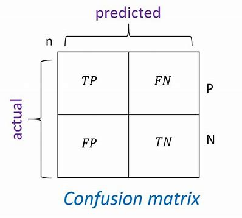
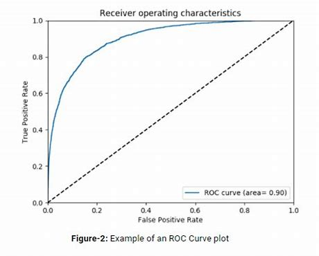
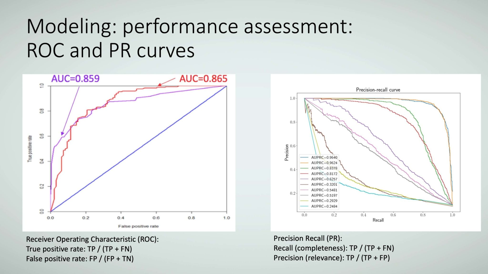

### 混淆矩阵:
对于二分类的分类问题, 我们可以根据样例将真实类别与预测类别的组合分为真正例(true positive),假正例(false positive),真反例(true negative), 假反例(false negative)四种情形.

- 假正例(FP, false positive)：被模型错误地预测为正类别的样本

- 假负例 (FN, false negative)：被模型错误地预测为正类别的样本

- 负例 (TN, true negative)：被模型正确地预测为负类别的样本

- 正例 (TP, true positive)：被模型正确地预测为正类别的样本

根据混淆矩阵可以计算如下指标:

tps和fps是阈值逆序排列后，不同阈值对应的tp和fp。tps[-1]为阈值为0时，所有的点都被预测为正咯，所以代表为真实的正例总数，fps[-1]为真实的反例总数

fps = [0, 1, 1, 1, 2, 3, 4, 5, 6, 7]

tps = [1, 1, 2, 3, 3, 3, 3, 3, 3, 3]

thresholds = [0.42600526758001989, 0.42017521636505745, 0.41936155918127238, 0.39760831479768338, 0.38769987193780364, 0.3667541015524296, 0.33998332945141224, 0.33803961944475219, 0.32367439192936548, 0.31689620142873609]

### ROC曲线
ROC曲线全称是‘受试者工作曲线’。ROC曲线越远离对角线，模型效果越好。如果要比较两个分类器的性能孰优孰劣，可以比较ROC曲线下的区域面积即为AUC值，AUC值越接近1模型的效果越好。

ROC 曲线下面积是，对于随机选择的正类别样本确实为正类别（recall），以及随机选择的负类别样本为正类别(fpr)，分类器更确信前者的概率。

纵轴：真正例率TPR=TP/（TP+FN）,也就是召回率Recall；

横轴：假正例率FPR=FP/（FP+TN）。

### PR曲线
PR图反应了分类器在不同阈值下识别正例的准确率和覆盖率之间的权衡。

在一些应用中，对查全率和查准率的重视程度有所不同。推荐系统中，更希望推荐商品是用户感兴趣的，此时查准率更重要；逃犯信息检索中，更希望少漏掉逃犯，查全率更重要，可以通过加权计算F1值来比较性能。

纵轴：查准率Precision=TP/（TP+FP），

横轴：查全率Recall=TP/（TP+FN）。

### Lift(提升)曲线
Lift 曲线是不同阈值下Lift和预测正例占比的轨迹。

在使用模型进行预测之后，模型的查准率为precision=TP/（TP+FP），在不使用模型之前，模型的查准率为pre_precision=(TP+FN)/(TP+FP+FN+TN),所以在使用模型之后，模型的查准率提升至Lift值=precision/pre_precision.Lift（提升）曲线衡量的是，与不利用模型相比，模型的预测能力“变好”了多少。lift(提升指数)越大，模型的运行效果越好。一般lift(提升指数)>1.

纵轴:Lift值=precision/pre_precision,

横轴：预测正例占比x=(TP+FP)/(TP+FP+FN+TN)

### Gain曲线
Gain增益图是描述整体精准率的指标.和Lift曲线在于纵轴刻度的不同。

纵轴：Gain=precision=TP/（TP+FP）,

横轴：预测正例占比x=(TP+FP)/(TP+FP+FN+TN)

### K-S曲线
KS曲线是正样本洛伦兹曲线和负样本洛伦兹曲线的差值曲线，KS曲线的最高点定义为KS值。

KS是检验阳性与阴性分类区分能力的指标，主要是验证模型的区分能力

纵轴：分别是TPR，FPR，与TPR与FPR的距离

横轴：预测正例占比x(阈值)

